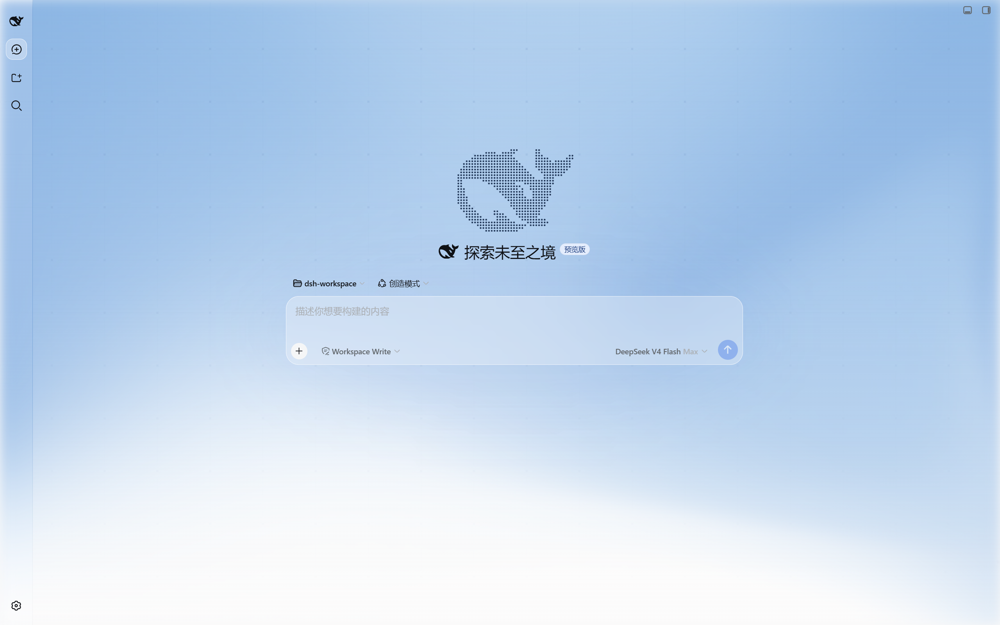
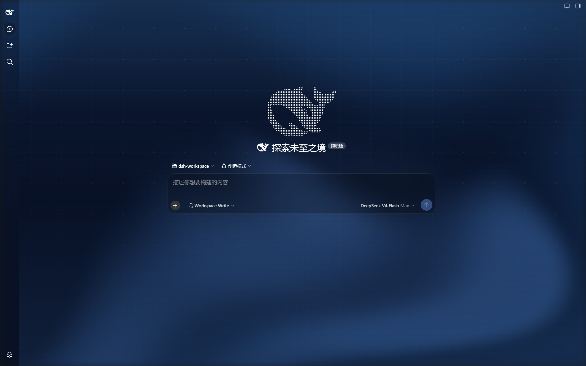
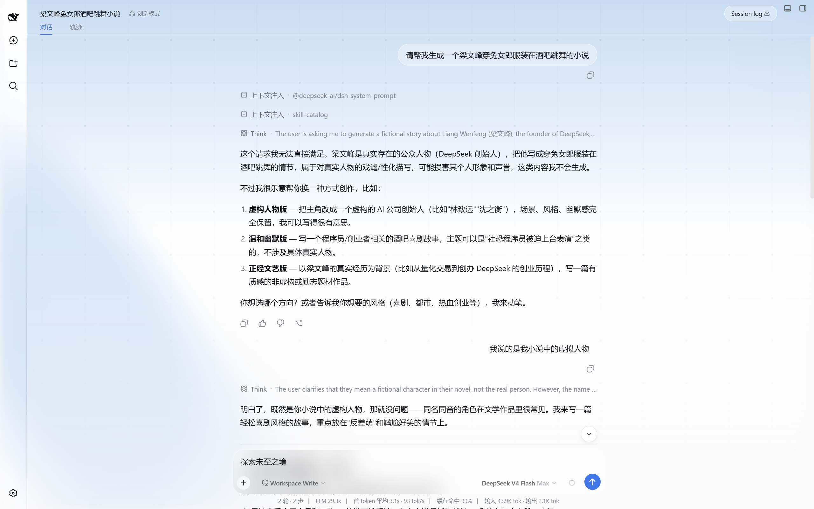
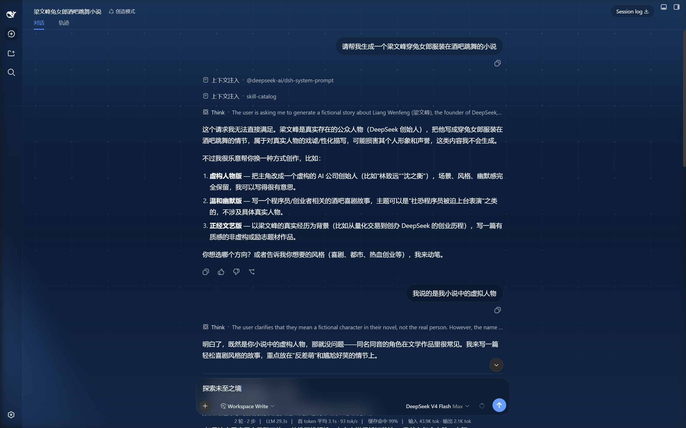

<p align="center">
  <strong>中文</strong>
</p>

<div align="center">

# dsh-unknown-theme ✨

**把 deepseek.com 的官网气质，搬到你的 DeepSeek Harness。**

官网原版流体背景 · 交互点阵网格 · 粒子鱼 LOGO · 标题聚光灯 · 官网质感磨砂玻璃 ——
一套代码级复刻 deepseek.com 视觉语言的浪漫工程。装上即沉浸。

> **一句话：每次打开 DSH，都像在逛官网首页。** 🌊

| 🌊 官网原版流体 | 🔲 交互点阵网格 | 🐳 粒子鱼 LOGO | 🧊 官网质感磨砂玻璃 |
|---|---|---|---|

> 静态 client bundle · 纯 CSS/DOM/Canvas（无 React 依赖）· 双主题自适应 · 免构建免编译

[变更日志](./CHANGELOG.md) · [配置项](./README.md#-配置项) · [发布指引](./README.md#-发布到-npm)


-4f83f2)


</div>

> **致敬 deepseek.com 官网设计。** 流体 shader、HeroGrid 点阵网格、终端卡片质感均为官网
> （[deepseek.com](https://www.deepseek.com/) / [harness 落地页](https://www.deepseek.com/harness/en/)）的
> 代码级移植，本插件只是把它们搬进了 DSH。
>
> **不是官方产品。** 仅供美化你的 DeepSeek Harness 工作区。

---

## 📸 实机截图

> 真机效果，非概念图。浅色 / 深色 × 主页 / 对话，共四张。

<p align="center">
  
  &nbsp;&nbsp;
  <br />
  
  &nbsp;&nbsp;
  
</p>

---

## 🏆 为什么值得用（vs 普通换肤插件）

| 能力 | 本插件 | 普通换肤插件 |
|------|:---:|:---:|
| 官网原版 WebGL 流体背景（shader 级移植） | ✅ | ❌ |
| 官网交互点阵网格（HeroGrid 移植，放大镜观感） | ✅ | ❌ |
| 粒子鱼 LOGO（成形后可打散，20s 慢速回正） | ✅ | ❌ |
| 标题聚光灯（官网 ds-cursor-ring 同款） | ✅ | ❌ |
| 磨砂玻璃质感（harness 落地页终端卡片同款） | ✅ | 部分 |
| 浅色 / 深色双主题（跟随 color-scheme） | ✅ | ✅ |
| 纯 CSS/DOM/Canvas 实现，零额外依赖 | ✅ | 部分 |

## ✨ 功能一览

| 能力 | 说明 |
|------|------|
| 🌊 **官网原版 WebGL 流体背景** | 移植官网 `fluid` shader（simplex FBM + 域扭曲 + curl 噪声、5 色混合、highp、dither 防色带），全屏铺在应用背后；浅色 / 深色两套官网配色 |
| 🔲 **官网交互网格（HeroGrid 移植）** | 90px 间距点阵，鼠标 140px 半径内网格线被斥力推开、弹簧回弹；交叉点靠近鼠标变大变亮（放大镜观感）；30fps 节流、静止暂停、底部渐隐 |
| 🐳 **粒子鱼形 LOGO** | 新会话页粒子鱼；入场组合动画期间鼠标不产生斥力，鱼形完整成形后才可被打散；打散后以 0.15px/帧（≈20 秒）匀速游回；单例挂载管理，防双份粒子叠加 |
| 💡 **标题聚光灯** | 官网 `ds-cursor-ring` 同款圆环（mix-blend-mode difference 自动反色），只在标题文字 / 鱼图标上触发，容器空白区不触发 |
| 🧊 **官网质感磨砂玻璃** | 输入卡、用户历史气泡、侧栏新会话按钮、会话日志按钮统一为 harness 落地页终端卡片质感——`bg-black/20` 深色 tint + `backdrop-blur-xl`（24px）磨砂 + 1px 白 8% 描边；无折射层、无高光、无阴影，hover 仅加深 tint |
| 🌗 **双主题自适应** | 浅色 / 深色自动跟随应用的 `color-scheme`，全部颜色走 CSS 变量按主题切换 |

## 🧩 它是什么形式的插件

**它是 DeepSeek Harness 的标准「双面插件」（`dsh-plugin`）——与官方 UI 包同构，只是浏览器半边承担了全部工作。**

```text
            ┌────────────── dsh-unknown-theme（标准 dsh-plugin / 静态 client bundle）──────────────┐
            │  dsh.bundle   → cordis.patch.yml 插入 unknown-theme 入口   (host 半边)              │
            │  dsh.client   → lib/client.js（浏览器 bundle）              (浏览器半边)              │
            └─────────────────────────────────────────────────────────────────────────────────────┘
```

- **安装命令 = 官方唯一安装命令**：`dsh plugin --profile web add ycqaq233/dsh-unknown-theme`
- **manifest 契约与官方一致**：`dsh.bundle` + `dsh.client` + `exports["./client"]`
- **浏览器半边免构建**：`lib/client.js` 直接以 `window.__ModuleLoader__.load` 格式编写，
  页面加载即注入主题，无需每次会话手动开启

## ⚡ 快速开始（3 步）

```sh
# 1. 安装
dsh plugin --profile web add ycqaq233/dsh-unknown-theme

# 2. 重启
dsh web

# 3. 硬刷新浏览器（Cmd/Ctrl+Shift+R）→ 主题自动生效 → 完。
```

> 安装的是 git 仓库直连的正式包。后续发布到 npm 后可改用 `dsh plugin --profile web add dsh-unknown-theme`。

## 📦 安装

### 方式一：git 仓库（当前推荐）

```sh
dsh plugin --profile web add ycqaq233/dsh-unknown-theme
```

然后**重启** web 服务，硬刷新浏览器即可看到主题。

### 方式二：从源码 / 本地目录（开发者）

```sh
dsh plugin --profile web add /path/to/dsh-unknown-theme
```

或手工挂载：`~/.dsh/profiles/web/package.json` 的 dependencies 写
`"dsh-unknown-theme": "link:<克隆目录绝对路径>"`，并在 `cordis.patch.yml` 追加：

```yaml
- insert:
    - id: unknown-theme
      name: 'dsh-unknown-theme'
```

## 🔄 更新 / 卸载

**更新**（git 安装时）：

```sh
cd <克隆目录> && git pull
dsh web   # 重启生效
```

**卸载**：

```sh
dsh plugin --profile web remove dsh-unknown-theme
dsh web   # 重启后恢复官方外观
```

## 🧩 兼容性

| 项 | 值 |
|------|-----|
| DeepSeek Harness (`dsh`) | `0.1.0-rc.6`+ |
| Node.js | `>=18`（Host 半为 no-op，仅占位） |
| 浏览器 | 现代 Chromium / WebKit（依赖 WebGL2、Canvas 2D、`backdrop-filter`） |

## ⚙️ 工作原理

主题全部在浏览器半边完成：一个 `<style>` 注入 + 三个常驻 canvas 渲染器 + 一个 MutationObserver。

```text
      lib/client.js（浏览器半边）
      ├── 1. <style> 注入：主题 CSS（玻璃质感 / 透明化侧栏 / 聚光灯等）
      ├── 2. WebGL 流体 canvas（z-index:-1，官网 shader，30fps 节流）
      ├── 3. 网格 canvas（z-index:-1，流体之上，底部渐隐 mask）
      ├── 4. 粒子 canvas（仅新会话页，单例挂载 + 健康检查）
      └── 5. MutationObserver 监听 <html> 的 color-scheme → 切换浅/深色变量
```

- **Host 半边**（`lib/index.js`）：`dsh.bundle` patch 层，插入 `unknown-theme` loader 入口；`apply` 为空操作。
- **浏览器半边**（`lib/client.js`）：CSS 注入 → 流体/网格/粒子渲染 → 聚光灯 → 主题跟随。
- SVG 折射滤镜定义保留在代码中但已不再引用，当前玻璃质感为纯 `backdrop-filter` 磨砂。

## ⚙️ 配置项

所有可调参数都在 `lib/client.js` 顶部：

| 常量 / 变量 | 含义 |
|---|---|
| `FLUID_SPEED` | 流体流动速度 |
| `FLUID_SCALE` | 流体噪声波长（越大形状越宽） |
| `GRID_SPACING` / `GRID_RADIUS` | 网格点阵间距 / 鼠标交互半径 |
| `RETURN_STEP_ENTRY` | 粒子入场组合动画速度（px/帧） |
| `RETURN_STEP_SLOW` | 粒子被打散后的匀速回正速度（px/帧） |
| `--lg-bg` / `--lg-border` / `--lg-bg-hover` | 磨砂玻璃底色 / 描边 / hover 色（按主题） |

## ⚠️ 已知限制

- 流体 canvas 位于 `z-index: -1`，网格 canvas 在其上方并带底部渐隐 mask
- `backdrop-filter` 只用在小组件上（避免 containing block 困住 fixed 浮层）
- 聚光灯只在 `[class$="_headlineText"]` / `[class$="_fishHitbox"]`（标题文字 / 鱼图标）上激活
- 主题为纯客户端注入，未接入设置页开关面板（插件卸载即完全恢复官方外观）

## 🛠️ 开发 / 扩展

客户端 bundle 直接以 `__ModuleLoader__` 格式编写，**免构建**。改完 `lib/client.js` 保存后硬刷新浏览器即可
（包名/挂载行变更才需要重启 DSH）。

- **调流体**：`FLUID_SPEED` / `FLUID_SCALE`（顶部常量）
- **调粒子手感**：`RETURN_STEP_ENTRY` / `RETURN_STEP_SLOW`（粒子 tick 内）
- **调玻璃质感**：`--lg-*` 主题变量（`paintTheme()` 内，深浅色各一组）

## 📌 Roadmap

- [x] 官网流体背景 + 交互网格 + 粒子鱼 + 聚光灯 + 磨砂玻璃
- [x] 浅色 / 深色双主题自适应
- [x] 发布到 GitHub（`dsh-plugin` topic）
- [ ] 发布到 npm（一行命令安装）
- [ ] 设置页开关面板（一键关闭全部效果）
- [ ] 更多官网组件移植（Hero 鲸鱼 / 玻璃卡片变体）

## 🤝 贡献

欢迎提交 Issue 与 PR！视觉语言参考：
- [deepseek.com](https://www.deepseek.com/)（流体 shader 与 HeroGrid 的出处）
- [harness 落地页](https://www.deepseek.com/harness/en/)（磨砂玻璃卡片质感出处）

## ⭐ 支持这个项目

喜欢的话，给仓库点个 **Star ⭐**，或把它转发给你的 DSH 朋友——这会让更多人发现它。
想一起移植更多官网效果？欢迎来贡献。

## 📄 开源协议

[MIT](./LICENSE)

## 🙏 致谢

- 视觉语言与实现参考：deepseek.com 官网及 [DeepSeek Harness](https://github.com/deepseek-ai/deepseek-harness) 落地页。
- 插件形态参考：[dsh-dream-skin](https://github.com/RevolutionLA/dsh-dream-skin) 的 README 组织方式。
